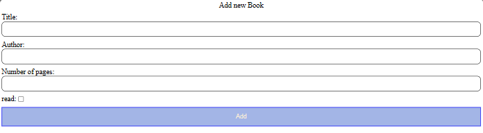
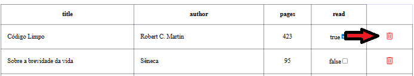
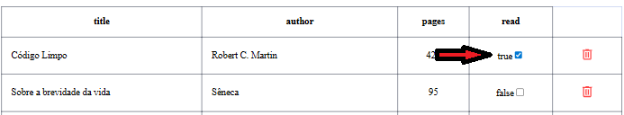
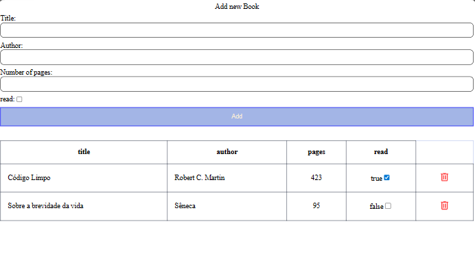

# Library
Biblioteca - projeto do The Odin Project
# Funcionalidades
- Inserir livro

    Campos: titulo, autor, número de página e se o livros foi lido
    
    
- Excluir livros

    Após inserir um livro é possivel apaga-lo clicando no botão de lixeira

    
- Alterar status de leitura

    Se o livro estiver marcado como não lido pode-se clicar no checkbox para indicar que o livro já foi lido e vice-versa

    
# Imagem da tela completa

    